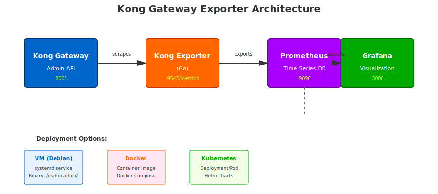

# Kong Gateway Exporter


**Développé par : Najeh TOUMI**  
**Date : Novembre 2025**  
**Technologies :** Go, Docker, Prometheus, Grafana, systemd

---

## 1️⃣ Objectif

Kong Gateway Exporter permet de :

- Scrapper l'API Admin de Kong et vérifier l'état du service.
- Exposer les métriques Prometheus via `/metrics`.
- Être déployé sur VM ou Docker.
- S'intégrer facilement avec Prometheus et Grafana.

---

## 2️⃣ Architecture



**Composants :**

1. Kong Gateway (API Admin sur port 8001)  
2. Exporter (Go) → `/metrics`  
3. Prometheus scrape l'exporter  
4. Grafana visualise les métriques  

---

## 3️⃣ Installation sur VM Debian

```bash
sudo apt update
sudo apt install -y golang
git clone https://github.com/najeh-toumi-devops/kong-gateway-exporter.git
cd kong-gateway-exporter
go build -o kong-gateway-exporter main.go
sudo mv kong-gateway-exporter /usr/local/bin/
sudo cp kong-gateway-exporter.service /etc/systemd/system/
sudo systemctl daemon-reload
sudo systemctl enable kong-gateway-exporter
sudo systemctl start kong-gateway-exporter
sudo systemctl status kong-gateway-exporter
curl http://localhost:9542/metrics
```

---

## 4️⃣ Installation Docker

```bash
docker build -t kong-gateway-exporter .
docker run -d -p 9542:9542 -e KONG_ADMIN_URL=http://kong:8001 kong-gateway-exporter
```

---

## 5️⃣ Configuration Prometheus

```yaml
global:
  scrape_interval: 15s

scrape_configs:
  - job_name: 'kong-exporter'
    static_configs:
      - targets: ['localhost:9542']
```

---

## 6️⃣ Métriques Disponibles

- `kong_info` - Information sur Kong Gateway
- `kong_services_total` - Nombre total de services
- `kong_routes_total` - Nombre total de routes
- `kong_consumers_total` - Nombre total de consumers
- `kong_plugins_total` - Nombre total de plugins

---

## 7️⃣ Structure du Projet

```
.
├── main.go                          # Fonction principale du exporter
├── go.mod                           # Dépendances Go
├── Dockerfile                       # Image Docker
├── kong-gateway-exporter.service    # Service systemd
├── README.md                        # Documentation
├── logo.svg                         # Logo du projet
└── images/
    └── architecture.svg             # Diagramme d'architecture
```

---

## 8️⃣ Support

Pour toute question ou problème, veuillez ouvrir une issue sur GitHub.
